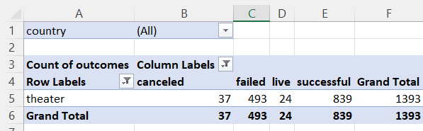
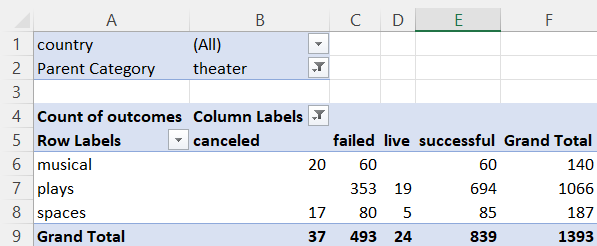
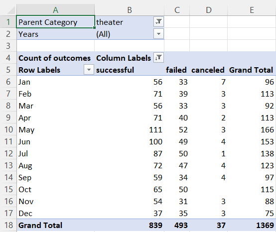
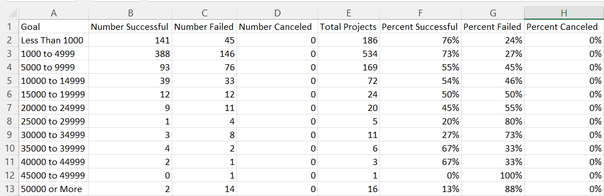
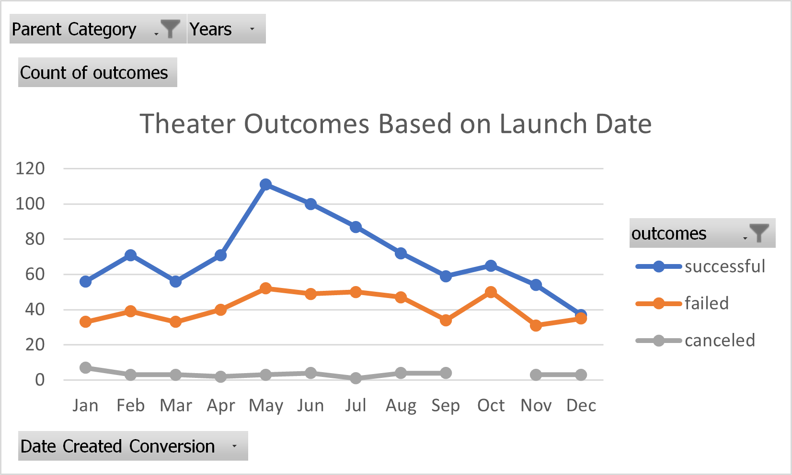
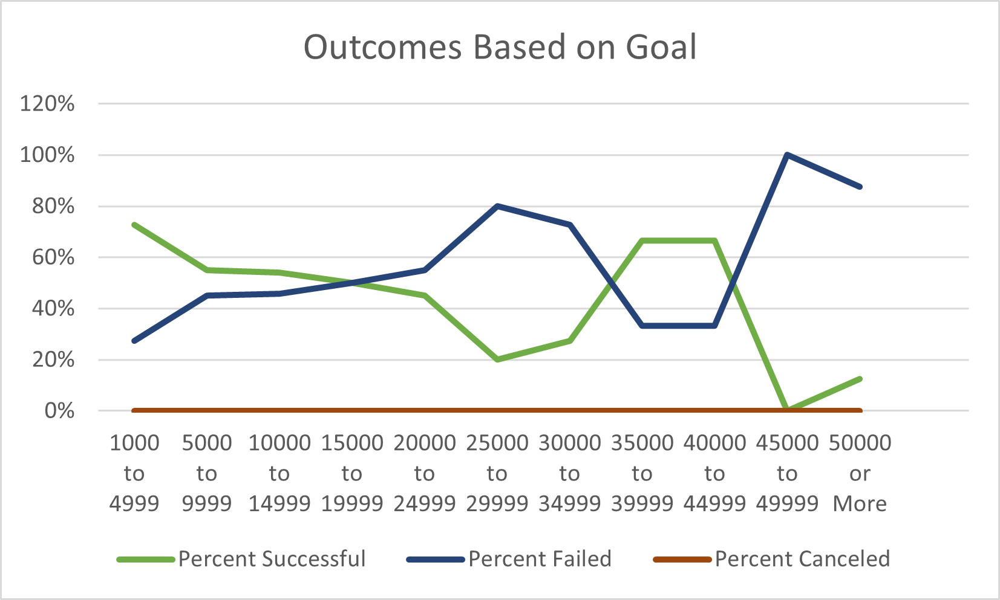

# Kickstarting with Excel

## Overview of Project
An analysis of Kickstarter campaigns was performed on data ranging from years 2009-2017 for campaigns of various budgets, countries of origin, and categories of project. 
### Purpose
This analysis was intended to assist client Louise in forecasting what her priorities should be in planning a successful Kickstarter campaign. This was accomplished by comparing the success or failure of other Kickstarter campaigns to their fundraising goals and launch dates so that Louise can properly plan for the scope and launch of her play's campaign.
## Analysis and Challenges
I began my analysis by applying visual formatting to the data by color-coding the "outcomes" column through conditional formatting. I then further determined *how* successful a campaign was by introducing a new column, "Percentage Funded," in which I calculated to what extent a campaign was funded compared to its original goal. Visual formatting was also applied to this column via a color scale from red to blue. Next, a new column was introduced with the intention of calculating the average donation per campaign backer, calculated by dividing the total pledged (column E) by the number of backers (column L). I noticed that this calculation provided errors for campaigns that had no backers, so I applied the "IFERROR" formula to compensate and clean the data. 

Because Louise indicated she would be campaigning for funding for a play, I decided to seperate the Category/Subcategory column into two seperate columns, "Parent Category" and "Subcategory." This allowed me to perform a more in-depth analysis utilizing PivotTables, indicating the number of outcomes specifically for the Parent Category "theater" as shown in the screenshot below.

I further analyzed the data by creating a PivotTable utilizing the Subcategory column, showing only the outcomes for the subcategories of theater campaigns. This allowed me to show Louise exactly how many play campaigns have succeeded, failed, or been canceled.

My next step in analyzing the data was converting the Unix time stamps in columns I and J into a readable format, now represented in columns S and T. Now that we have the start dates and end dates for campaigns, we can more closely analyze how the launch date affects the success of a campaign.

### Analysis of Outcomes Based on Launch Date

To perform this analysis, I began by making a PivotTable, with the month launched as my row data. For my columns, I selected outcomes and for my values I selected count of outcomes. I then filtered by year and by Parent Category so that I can further specify if necessary. I decided to focus solely on outcomes for theater campaigns.

I then decided to visually represent this data using a line chart with markers, which will be shown in the results portion of this analysis. Visual representation provides a broader look at trends in data and can be extremely useful.

### Analysis of Outcomes Based on Goals

Launch date appears to have a significant effect on the success of a campaign, however I wanted to further analyze a potential factor in the success of a campaign: its fundraising goal. I did this by creating several budget categories, as shown in the screen shot below.

I then used the COUNTIF function to pull the number of campaigns that succeeded, failed, or were canceled specifically for the subcategory "plays" and the goal tier indicated to the left. This provided a clear trend which I then decided to visually represent by inserting a line chart, which will be shown below in the results portion.

### Challenges and Difficulties Encountered

I did initally encounter some difficulty in creating PivotTables, as Excel kept adding blank rows and columns to my data. I was able to remedy this by unselecting the blank options in the row and column filters.

Further on in my analysis, I encountered some difficulty in properly displaying the relationship between goal of a campaign and the percentage of campaigns that were successful, failures, or canceled. The chart was initially unreadable, until I was able to flip the x and y axis and specify the goal tiers as the x-axis values. After toggling these features, the chart displayed correctly.

## Results

### Outcomes Based on Launch Date

#### First Conclusion

My first conclusion in regards to the analysis of Theater Outcomes Based on Launch date is that May is the most successful month to launch a theater campaign, even when taking into consideration that May has more campaigns launched than any other month. June follows closely behind as the second-most successful month to launch a campaign.

#### Second Conclusion

The second conclusion I've drawn from this analysis is that the least sucessful months to launch a campaign are October and December. October has a higher number of failed campaigns, but had more campaigns launched overall than December. The percentage of failed campaigns for October and December were 43% and 47% respectively.

### Outcomes Based on Goals

#### First Conclusion

The first significant conclusion I arrived at when analyzing this data is that the most successful fundraising goals were those between $0 to $5000, with goals under $1000 having the highest percentage of success overall. This is logical, as a smaller goal is more likely to be funded by smaller, individual contributions.

#### Second Conclusion

The second conclusion I arrived at was that, with the exception of outliers in the $35,000 - $45,000 goal range, the higher the goal is, the less likely it is that the campaign will be successful. Again, this is logical as Kickstarters are funded by individual contributions which are likely to be smaller in nature. If a goal is lofty, it is extremely unlikely to be funded by small individual contributions unless the campaign goes "viral."

### Limitations of Dataset

#### First Limitation

A limitation that I initially noticed in this dataset is that the Outcomes Based on Launch Date chart takes into account the number of successful/failed/canceled campaigns, but does not take into account how many campaigns were launched in that month overall. For example, 2.2x more campaigns were launched in May than in December. I feel as though it would have been better to analyze what percentage of campaigns were successful, failed or canceled as opposed to how many.

#### Second Limitation

Another limitation I noticed were the outliers in the Outcomes Based on Goals chart. Based upon the overall trend of the chart, you would expect the percentage of success to linearly decrease as the goal increased. However, due to the small number of campaigns launched with goals between $35,000 and $45,000, their percentage of success is significant even though only 6 plays were successful. 

### Further Recommendations

As mentioned above, I feel as thought it would be effective to calculate the percentage of plays that were successful, failed or canceled and compare it to the launch date to get a more accurate representation of which month would be better for launching a campaign. In addition, I think it would interesting to investigate the average number of backers per campaign goal tier, possibly visualized via a line chart, to help show Louise which campaign goal attracts the highest number of backers.

